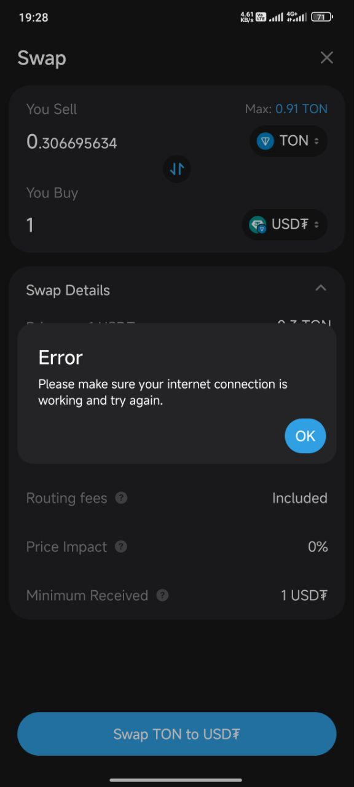

# MyTonWallet Air Bug Reports

# [1. Swap Error, internet connection](#1-swap-error-please-make-sure-your-internet-connection-is-working-and-try-again)
# [2. Incorrect Price on TON](#2-incorrect-ton-currency-display)

## Environment
• Device model: POCO X6 Pro Xiaomi HyperOS 2.0.100.0  
• OS version: Android 15 AP3A.240905.015.A2  
• App version: MyTonWallet Air v4.0-alpha (22)

## 1. Swap Error, "Please make sure your internet connection is working and try again"
Swap operation failed with an error related to internet connection, even though my internet was working properly. After entering the passcode/fingerprint, the loading took a long time (around a minute), and an error message appeared. I also received a push notification: "Swap TON>USDT Expired".

### Steps to Reproduce
1. Go to the swap page in the app  
2. Choose the pair and amount (I selected TON to receive 1 USDT)  
3. Enter passcode/fingerprint (this part took a long time to load, and then I was redirected back)  
4. An error message appeared: "Error, Please make sure your internet connection is working and try again"  
5. Because of that error message, I performed the swap again, and it succeeded without any issue  
6. However, when I checked my USDT balance, it had increased by $2, even though there was only one swap transaction in the history  
7. I noticed two notifications: "Swap TON>USDT Expired" and "Swapped TON>USDT"  
8. About a minute later, another notification appeared: "Swapped TON>USDT"

### Screenshots

USDT Expired" width="300"/>

### Additional Context
This only happened once. After that, everything returned to normal—transaction history and balance were correct.

## 2. Incorrect TON Currency Display

In addition to fiat currencies like USD, RUB, etc., there are also crypto currencies such as BTC and TON. However, the TON currency is displaying incorrect prices. For example, the price of 1 USDT is shown as 7 TON, which is inaccurate.

### Steps to Reproduce
1. Go to the "My Wallet" page  
2. Select TON as the currency  
3. Observe that the displayed prices are significantly different from actual market values

### Screenshots

### Additional Context
I only checked the USDT/TON and NOT/TON pairs, and both displayed incorrect values. I haven’t verified other crypto or fiat currency pairs yet.

## My TON address
### UQDfISizGUE350py_fYVfhI-eeLZfQJYnywheDk6gb11TWXj
